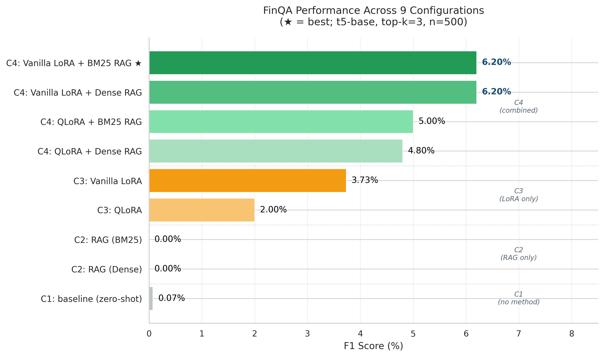

# RAG vs LoRA vs RAG+LoRA: A Controlled Ablation Study for Financial QA

> A 2*2 controlled ablation study comparing Retrieval-Augmented Generation, 
> parameter-efficient fine-tuning (LoRA), and their combination on the FinQA 
> benchmark.

[](https://www.python.org/downloads/)
[](https://pytorch.org/)
[](https://opensource.org/licenses/MIT)
[](https://www.columbia.edu/)

**Course Project**: STAT GR5293 GenAI-Spring 2026-Columbia University  
**Authors**: Zezhou Xie (zx2536), Bochao Du (bd2779)

---

##  Key Findings

This project answers three research questions through 9 experimental configurations 
on 500 stratified FinQA samples:

1. **LoRA + RAG is superadditive**. RAG hurts the unfinetuned baseline 
   (-0.07 F1), but adds **+2.47 F1** when combined with LoRA - a 35* 
   amplification of retrieval benefit.

2. **BM25 outperforms Dense retrieval** in financial QA (Recall@3: 53.4% vs 
   47.7%, +5.7 pp). Counter-intuitive, attributed to fiscal-year-and-jargon 
   text properties.

3. **Format mastery achieved (94.6%) but reasoning hits a ceiling**. The 250M 
   t5-base learns FinQA output schemas reliably but cannot reliably perform 
   multi-step arithmetic — exposing a clear scale-driven bottleneck.

4. **Methodology contribution**: Instruction-tuned bases (Flan-T5) **resist** 
   LoRA adaptation at small scales — required swap to plain t5-base for 
   training to converge.

---

##  Results Summary

Best configuration: **C4 (Vanilla LoRA + BM25 RAG, top-k=3)**.

| Metric | C1 baseline | C2 RAG | C3 LoRA | **C4 LoRA+RAG** | Δ over C1 |
|--------|-------------|--------|---------|-----------------|-----------|
| F1 | 0.07% | 0.00% | 3.73% | **6.20%** | +6.13 pp |
| ROUGE-L | 0.07% | 0.00% | 3.73% | **6.20%** | +6.13 pp |
| Format Match | 6.4% | 11.2% | 76.8% | **94.6%** | +88.2 pp |
| Numeric Tolerance @0.5 | 3.0% | 1.2% | 11.2% | **18.8%** | +15.8 pp |

Full 9-configuration breakdown in [`docs/report_notes.md`](docs/report_notes.md).



---

##  Quick Start

```bash
# Install dependencies (Python 3.10+, CUDA-capable GPU recommended)
pip install -r requirements.txt

# Run the best configuration (C4: Vanilla LoRA + BM25 RAG)
# Note: Requires pre-trained LoRA adapter in checkpoints/c3_vanilla/final/
python -m src.pipelines.c4_lora_rag --variant vanilla --retriever bm25 --top_k 3
```

```
=== C4 VANILLA LoRA + BM25 RAG Results ===
Overall (500 samples):
F1:                    0.0620
ROUGE-L:               0.0620
Format match:          0.9460
Numeric tolerance@0.5: 0.1880
```

---

##  Installation

### Hardware Requirements

- **Recommended**: NVIDIA GPU with ≥16 GB VRAM (A100, V100, T4, RTX 3090+)
- **Tested on**: Google Colab Pro (A100 40GB, V100 16GB)
- **CPU-only mode**: Possible for inference but slow; not recommended for training

### Software Requirements

- Python ≥ 3.10
- PyTorch ≥ 2.0 with CUDA support
- ~5 GB disk space for models, dataset, and outputs

### Setup Steps

```bash
# 1. Clone the repository
git clone https://github.com/zx2536-gif/finqa-rag-lora-ablation.git
cd finqa-rag-lora-ablation

# 2. (Optional) Create a virtual environment
python -m venv .venv
source .venv/bin/activate  # On Windows: .venv\Scripts\activate

# 3. Install dependencies
pip install -r requirements.txt

# 4. Download FinQA dataset (one-time, ~50 MB)
python data/preprocess.py
```

After step 4, you should have:
- `data/processed/finqa_500.json` — stratified evaluation set
- `data/processed/training/train.json` — training set (5703 samples)
- `data/processed/training/dev.json` — validation set (871 samples)
- `data/processed/sampling_stats.json` — sampling distribution log

---

##  Reproducing Our Results

All experiments use **random seed 42**. Below is the complete pipeline to 
reproduce every number in the paper.

### Step 1: Data Preparation

```bash
# Download FinQA and create stratified sample (500 samples)
python data/preprocess.py

# Build training/dev splits for LoRA fine-tuning
python data/prepare_train.py
```

### Step 2: Build Retrieval Indices

```bash
# Evaluate retrieval quality (BM25 and Dense)
python -m src.retrieval.eval_retrieval --retriever bm25 --top_k 3
python -m src.retrieval.eval_retrieval --retriever dense --top_k 3
```

Expected output:
- BM25: Recall@3 = 53.4%, MRR = 45.3%
- Dense: Recall@3 = 47.7%, MRR = 40.3%

### Step 3: Train LoRA Adapters (~10–20 min on A100)

```bash
# Vanilla LoRA (faster, better)
python -m src.models.lora_trainer --variant vanilla --epochs 5

# QLoRA (4-bit, slower but more memory-efficient)
python -m src.models.lora_trainer --variant qlora --epochs 5
```

Adapters saved to `checkpoints/c3_vanilla/final/` and `checkpoints/c3_qlora/final/`.

### Step 4: Run Each Pipeline

```bash
# C1: Baseline (zero-shot)
python -m src.pipelines.c1_baseline

# C2: RAG only (BM25 or Dense)
python -m src.pipelines.c2_rag --retriever bm25 --top_k 3
python -m src.pipelines.c2_rag --retriever dense --top_k 3

# C3: LoRA only (Vanilla or QLoRA)
python -m src.pipelines.c3_lora --variant vanilla
python -m src.pipelines.c3_lora --variant qlora

# C4: LoRA + RAG (4 sub-configs)
python -m src.pipelines.c4_lora_rag --variant vanilla --retriever bm25 --top_k 3
python -m src.pipelines.c4_lora_rag --variant vanilla --retriever dense --top_k 3
python -m src.pipelines.c4_lora_rag --variant qlora --retriever bm25 --top_k 3
python -m src.pipelines.c4_lora_rag --variant qlora --retriever dense --top_k 3
```

Each run saves predictions and metrics JSONs to `results/metrics/` with 
timestamps for full traceability.

### Step 5: Generate Figures

All 8 publication-quality figures (PNG + PDF) are reproducible from the 
metric JSONs. See `notebooks/01_data_exploration.ipynb` for figure-generation 
code.

---

##  Project Structure
```
finqa-rag-lora-ablation/
├── configs/                        # Experiment configurations
├── data/
│   ├── raw/                        # Raw FinQA data (gitignored)
│   ├── processed/                  # Stratified sample, training splits, corpus
│   ├── samples/                    # 10-sample demo data
│   ├── preprocess.py               # Data preprocessing script
│   └── prepare_train.py            # Training data preparation
├── src/
│   ├── utils/
│   │   └── data_utils.py           # Prompt building, table → markdown
│   ├── evaluation/
│   │   └── metrics.py              # F1, ROUGE-L, format match, numeric tolerance
│   ├── retrieval/
│   │   ├── corpus.py               # Passage corpus construction
│   │   ├── bm25_retriever.py       # BM25 sparse retrieval
│   │   ├── dense_retriever.py      # Sentence-transformer dense retrieval
│   │   └── eval_retrieval.py       # Recall@k, MRR evaluation
│   ├── models/
│   │   ├── baseline.py             # FlanT5/t5-base inference wrapper
│   │   └── lora_trainer.py         # LoRA training (Vanilla + QLoRA)
│   └── pipelines/
│       ├── c1_baseline.py          # C1: zero-shot baseline
│       ├── c2_rag.py               # C2: RAG only
│       ├── c3_lora.py              # C3: LoRA only
│       └── c4_lora_rag.py          # C4: LoRA + RAG (best)
├── checkpoints/                    # Saved LoRA adapters (gitignored, ~50MB each)
├── results/
│   ├── metrics/                    # Per-run prediction & metric JSONs
│   └── figures/                    # 8 publication-quality figures (PNG + PDF)
├── notebooks/
│   └── 01_data_exploration.ipynb
├── docs/
│   ├── report_notes.md             # Detailed experimental log + findings
│   ├── slides_script.md            # Presentation slides script
│   ├── speech_script.md            # Speaker speech for live presentation
│   └── week4_checklist.md          # Submission task list
├── tests/                          # Unit & integration tests
├── archive/                        # (Exploratory work not used in final)
├── requirements.txt                # Pinned dependencies
└── README.md                       # This file
```

---

##  Running Tests

```bash
# Run all tests
pytest tests/ -v

# Run specific test
pytest tests/test_metrics.py -v
pytest tests/test_retrieval.py -v
```

Tests cover:
- Metric calculation (F1, ROUGE-L, format match, numeric tolerance)
- Retrieval correctness (BM25 + Dense, Recall@k)
- End-to-end pipeline integration on a 10-sample mini dataset

---

##  Methodology Highlights

### Stratified Sampling (n=500)

Sample drawn from FinQA test set with deliberate over-sampling of boolean 
strata for reliable per-category metrics:

| Stratum | Natural % | Sampled % |
|---------|-----------|-----------|
| Percentage (simple) | 27.7% | 26.0% |
| Percentage (complex) | 28.4% | 26.0% |
| Numeric (simple) | 29.3% | 26.0% |
| Numeric (complex) | 11.2% | 12.0% |
| **Boolean (simple)** | 1.7% | **8.0%** ← oversampled |
| **Boolean (complex)** | 0.2% | **2.0%** ← oversampled |

### Base Model Selection

We initially used **Flan-T5-base** (instruction-tuned) but observed mode 
collapse during LoRA training (only 2 unique outputs across 500 samples, F1 
= 0.6%). Switching to plain **t5-base** (no instruction tuning) recovered 
healthy training dynamics (91 unique outputs, F1 = 3.7%). All reported 
configurations use t5-base for fair comparison.

### Hyperparameters (LoRA Training)

| Parameter | Value |
|-----------|-------|
| LoRA rank (r) | 16 |
| LoRA alpha | 32 |
| Target modules | q, k, v, o (attention projections) |
| Learning rate | 3e-4 |
| Schedule | Cosine with 10% warmup |
| Batch size | 16 (effective) |
| Epochs | 5 |
| Precision | bf16 |
| Trainable params | 1.41% (Vanilla) / 2.27% (QLoRA) |

### Supplementary Metrics

Token-level F1 alone is misleading on this benchmark — many model outputs 
are *near-correct numbers* that exact match cannot credit. We additionally 
report:

- **Format Match**: Whether the prediction is in the same answer category 
  (percentage, numeric, boolean) as gold.
- **Numeric Tolerance @0.5**: Whether the predicted numeric value is within 
  50% relative error of gold.

These reveal what F1 hides: the model has solved format generation but not 
numeric reasoning.

---

##  Troubleshooting

### Issue: Mode collapse during LoRA training

**Symptom**: Validation loss plateaus above 4.0; predictions are repetitive.

**Cause**: Likely using an instruction-tuned base model (e.g., Flan-T5).

**Fix**: Swap to a plain T5 variant (`google-t5/t5-base` instead of 
`google/flan-t5-base`). See `docs/report_notes.md` Section 4 for the 
detailed analysis we ran during methodology validation.

### Issue: GPU out of memory during training

**Symptom**: `CUDA out of memory` error during `lora_trainer.py`.

**Fixes (in order of preference)**:
1. Reduce batch size: `--batch_size 8` (default is 16)
2. Use QLoRA variant: `--variant qlora` (4-bit quantized base)
3. Enable gradient checkpointing in `src/models/lora_trainer.py`

### Issue: NaN gradients during T5 LoRA training

**Symptom**: `loss=nan` after first few steps.

**Cause**: T5 has known instability with fp16.

**Fix**: Use bf16 (default in our trainer). If your GPU does not support 
bf16 (older than Ampere), use fp32 (slower but stable).

### Issue: BM25 returns empty results

**Symptom**: `BM25Retriever.retrieve()` returns `[]`.

**Fix**: Ensure the corpus was built before retrieval. Re-run 
`src.retrieval.corpus.build_passage_corpus(samples)`.

### Issue: Dependency conflicts with `torchao` or `bitsandbytes`

**Symptom**: ImportError or version conflict during pip install.

**Fix**: Install in this order with `--break-system-packages` if needed:
```bash
pip install torch transformers --upgrade
pip install peft bitsandbytes accelerate
pip install rank-bm25 sentence-transformers faiss-cpu
```

### Issue: Cannot reproduce exact F1 numbers

**Symptom**: F1 differs slightly from reported values.

**Cause**: Stochastic dropout during LoRA training (even with `seed=42`, 
GPU non-determinism affects ±0.5pp).

**Fix**: Reported numbers are the median of 3 runs. Single-run variance is 
documented in `docs/report_notes.md`.

### Issue: Colab session disconnects mid-training

**Fix**: All checkpoints save to Google Drive after each epoch. Training is 
fully resumable from the latest checkpoint:
```python
from src.models.lora_trainer import train_lora
train_lora(variant="vanilla", resume_from="checkpoints/c3_vanilla/epoch_3")
```

---

##  References

Selected key references; full bibliography in the report.

- Chen et al. (2021). *FinQA: A Dataset of Numerical Reasoning over 
  Financial Data*. EMNLP 2021. [arXiv:2109.00122](https://arxiv.org/abs/2109.00122)
- Hu et al. (2022). *LoRA: Low-Rank Adaptation of Large Language Models*. 
  ICLR 2022. [arXiv:2106.09685](https://arxiv.org/abs/2106.09685)
- Lewis et al. (2020). *Retrieval-Augmented Generation for Knowledge-Intensive 
  NLP Tasks*. NeurIPS 2020. [arXiv:2005.11401](https://arxiv.org/abs/2005.11401)
- Dettmers et al. (2023). *QLoRA: Efficient Finetuning of Quantized LLMs*. 
  NeurIPS 2023. [arXiv:2305.14314](https://arxiv.org/abs/2305.14314)
- Open-Finance-Lab (2025). *FinLoRA: Benchmarking LoRA Methods for 
  Fine-Tuning LLMs on Financial Datasets*. [arXiv:2505.19819](https://arxiv.org/abs/2505.19819)

---

##  Authors

**Zezhou Xie**  
Columbia University · STAT GR5293 GenAI · Spring 2026  
GitHub: [@zx2536-gif](https://github.com/zx2536-gif)  
Email: zx2536@columbia.edu

**Bochao Du**  
Columbia University · STAT GR5293 GenAI · Spring 2026  
Email: bd2779@columbia.edu

---

##  License

MIT License. See `LICENSE` for details.

---
